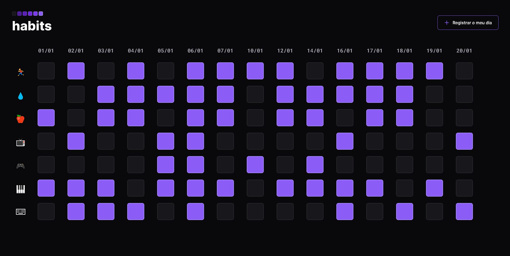

<h1 align="center"> NLW #11 Setup - Explorer </h1>

Evento exclusivo e gratuito realizado do dia 16/01/2023 até 23/01/2023, promovido pela Rocketseat para ensino de tecnologias WEB.

s
<a href="#tecnologias">Tecnologias</a>&nbsp;&nbsp;&nbsp;|&nbsp;&nbsp;&nbsp;
<a href="#projeto">Projeto</a>&nbsp;&nbsp;&nbsp;|&nbsp;&nbsp;&nbsp;
<a href="#layout">Layout</a>&nbsp;&nbsp;&nbsp;|&nbsp;&nbsp;&nbsp;
<a href="#memo-licença">Licença</a>

 

## Tecnologias

Esse projeto foi desenvolvido com as seguintes tecnologias:

- HTML e CSS
- JavaScript
- Git e Github
- Figma

## Projeto

O Habits é um app para ajudar a rastrear os hábitos, cadastrando o dia atual para eventual controle.

## Layout

Você pode visualizar o layout do projeto através [DESSE LINK](https://www.figma.com/file/dui6GDGast3pSmF8v3b9ax/Habits-(e)-(Community)?node-id=75%3A128&t=qs410XLpJlpEbTUF-0). É necessário ter conta no [Figma](https://figma.com) para acessá-lo.

## :memo: Licença

Esse projeto está sob licença MIT.

---

Projeto realizado pela Rocketseat e feito e adaptado por Victor Pimenta. [LinkedIn](https://www.linkedin.com/in/victor-cardoso-pimenta-0250371a0/)